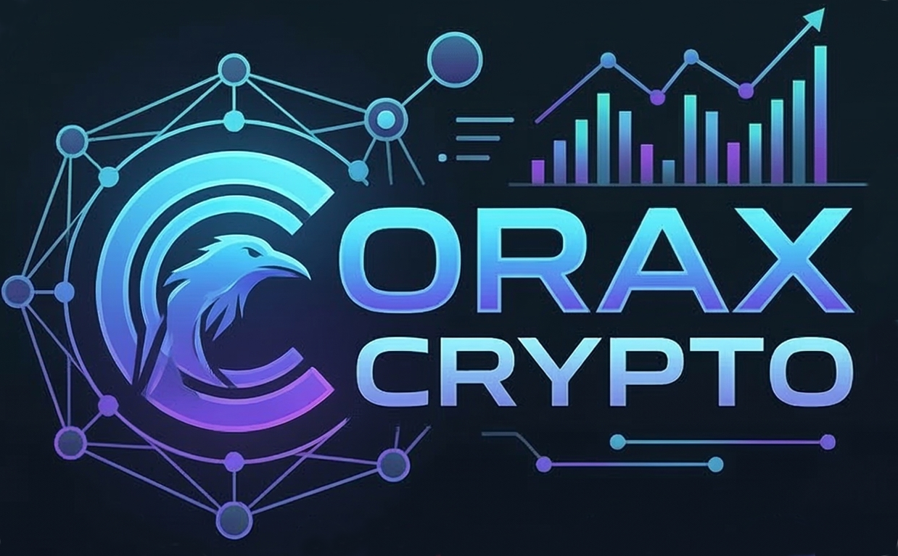

<div align="center">
  

  <h1 style="color: #00ffcc; text-transform: uppercase; letter-spacing: 2px;">
    Corax Crypto <br>
    <span style="font-size: 0.5em; color: #ff0055;">Autonomous HFT Agent</span>
  </h1>
  <p style="font-size: 1.2rem; color: #a0aec0; margin-bottom: 20px;">
    <i>Quantum Spatial Interface • 100% Polars-Native Execution • Web3 Cross-Chain Bridging</i>
  </p>

  <!-- Badges -->
  <p>
    <a href="https://www.python.org/"></a>
    <a href="https://pola.rs/"></a>
    <a href="https://fastapi.tiangolo.com/"></a>
    <a href="https://docs.docker.com/"></a>
    <a href="https://www.circle.com/"></a>
    <a href="https://threejs.org/"></a>
    
  </p>
</div>

<hr style="border: 1px solid #00ffcc; opacity: 0.3;" />

<div align="center">
  <h2 style="color: #ff0055; text-transform: uppercase;">⚠️ Hackathon Origins & Evolution</h2>
  <p style="font-size: 1.1em; color: #e2e8f0; max-width: 800px; margin: 0 auto; line-height: 1.6;">
    Corax Crypto was proudly featured in the <b>Agora Agents Hackathon (Pod 4)</b>, but it is important to note:
    <br><i><b>It was not built solely for the hackathon.</b></i><br>
    This project is the culmination of extensive research and development in high-frequency trading, autonomous economic actors, and spatial computing, continuing to evolve far beyond the scope of a single event.
  </p>
</div>

<br>
<hr style="border: 1px solid #00ffcc; opacity: 0.3;" />

## ⚡ System Overview

**Corax Crypto** is a next-generation, asynchronous High-Frequency Trading (HFT) platform and Autonomous Economic Actor (AEA). It bridges the gap between raw quantitative execution, decentralized on-chain settlement, and high-level macro intelligence.

Corax Crypto pioneers a new standard using a 100% **Polars-native** data pipeline, an asynchronous `ccxt.pro` execution loop, and a stunning Cyberpunk-themed 3D WebGL Command Center.

<hr style="border: 1px dashed #333;" />

## 🏆 World-Class Features

We have pushed the boundaries of what an automated trading agent can do. Explore our core world-class implementations:

<details>
<summary><b>🔥 1. Statistical Arbitrage (Pairs Trading) Engine</b></summary>
<br>
Utilizes Polars to perform blazing-fast, vectorized calculations of rolling Z-Scores across asset pairs, identifying and trading statistically significant mean-reverting deviations in real-time.
</details>

<details>
<summary><b>🧠 2. Predictive Regime Detection (Markov Chain HMM)</b></summary>
<br>
Upgrades standard regime classification by tracking historical state transitions. It builds a live probability matrix to actively predict the <i>next</i> market regime, allowing strategies to pre-position before the shift occurs.
</details>

<details>
<summary><b>🛡️ 3. Liquidity Velocity Circuit Breaker</b></summary>
<br>
A dynamic, microsecond-level safety mechanism that calculates the rate-of-change (velocity) of liquidity and price. If liquidity evaporates violently, it triggers a protective halt <i>before</i> traditional drawdown limits are even hit.
</details>

<details>
<summary><b>📝 4. Autonomous Trade Rationale Journaling</b></summary>
<br>
Every executed trade triggers an asynchronous call to the LLM Copilot, generating a contextual rationale based on the current regime, price action, and signal. This rationale is logged to a highly queryable JSON journal for advanced post-trade analysis.
</details>

<details>
<summary><b>🌌 5. Quantum Liquidity Heatmap (3D WebGL)</b></summary>
<br>
The UI features a toggleable 'HEATMAP' mode in the Three.js spatial interface. It visualizes market volume and order book depth as glowing, dynamic floor tiles, providing operators with a literal "heat signature" of market liquidity.
</details>

<hr style="border: 1px dashed #333;" />

## 📸 Media Showcase: The Quantum Command Center

Experience the market through our fully immersive 3D WebGL interface.

### 🌐 Corax Telemetry HUD
<div align="center">
  
  <p><i>Live L2 Order Book visualization, reactive particle systems, and real-time LLM synthesis overlay.</i></p>
</div>

### 💬 NLP Telegram Command Center
<div align="center">
  
  <p><i>Natural language execution and emergency Risk Manager Kill Switch via aiogram.</i></p>
</div>

### 💻 Async Terminal Logs
<div align="center">
  
  <p><i>Non-blocking asyncio loop handling simultaneous multiplexing across Binance, Bybit, and OKX.</i></p>
</div>

<hr style="border: 1px solid #00ffcc; opacity: 0.3;" />

## 🛠️ Architecture Deep-Dive

<details>
<summary><b>🔬 Click to explore the technical stack</b></summary>
<br>

*   **Core Engine:** Python 3.11+, fully non-blocking `asyncio` loop. `pydantic-settings` enforces a 'Fail-Fast' environment validation upon boot.
*   **Data Layer:** `Polars` for dataframes, `PyArrow` for Parquet data persistence. Millisecond-level HFT execution loop.
*   **API & Comms:** decoupled `FastAPI` + `Uvicorn` layer serving real-time WebSockets to the frontend.
*   **Trading:** `ccxt.pro` for async Level 2 depth streaming. Dynamic Profitability Calculator accounts for CEX fees, slippage, and on-chain bridge fees.
*   **UI/Visualization:** Vanilla JS, `Three.js` (WebGL) for the 3D Quantum Market Dashboard, `Lightweight Charts` for candlestick rendering.
*   **Risk Management:** Strict enforcement of max risk percentage, daily drawdown limits (Kill Switch), and dynamic ATR Trailing Stops.
</details>

<details>
<summary><b>🚀 Setup & Deployment Instructions</b></summary>
<br>

Corax Crypto uses a 'Fail-Fast' design. It will crash immediately at startup if required `.env` secrets are missing.

### Option A: Docker (Recommended)
```bash
git clone https://github.com/PelleNybe/corax-crypto.git
cd corax-crypto
cp .env.example .env
# Edit .env with your Circle W3S API keys and Exchange credentials
docker compose up -d --build
```

### Option B: Local Environment (Poetry)
*Requires `package-mode = false` in `pyproject.toml`.*
```bash
curl -sSL https://install.python-poetry.org | python3 -
poetry install
cp .env.example .env
poetry run python main.py
```
</details>

<hr style="border: 1px solid #00ffcc; opacity: 0.3;" />

## 👨‍💻 Visionaries Behind the Code

<div align="center" style="background: linear-gradient(135deg, rgba(11, 15, 25, 0.9), rgba(20, 30, 48, 0.9)); padding: 40px; border-radius: 20px; border: 2px solid #00ffcc; box-shadow: 0 0 30px rgba(0, 255, 204, 0.2); position: relative; overflow: hidden;">

  <!-- Decorative Background Elements -->
  <div style="position: absolute; top: -50px; left: -50px; width: 100px; height: 100px; background: #00ffcc; filter: blur(50px); opacity: 0.5;"></div>
  <div style="position: absolute; bottom: -50px; right: -50px; width: 100px; height: 100px; background: #ff0055; filter: blur(50px); opacity: 0.3;"></div>

  

  <h2 style="color: #ffffff; margin: 0; font-size: 2.5em; letter-spacing: 1px; position: relative; z-index: 10;">Pelle Nyberg</h2>
  <p style="color: #00ffcc; font-size: 1.2em; margin-top: 5px; font-weight: bold; position: relative; z-index: 10;">
    <em>CEO • Deep Tech Developer • AI & Robotics Innovator</em>
  </p>

  <p style="color: #e2e8f0; font-size: 1.1em; max-width: 650px; margin: 20px auto; line-height: 1.6; position: relative; z-index: 10;">
    Pelle specializes in pushing the boundaries of autonomous systems, quantitative finance, and spatial computing. With a passion for building next-generation technology, his work bridges the gap between complex algorithms and immersive human-computer interfaces.
  </p>

  <div style="margin: 25px 0; position: relative; z-index: 10;">
    <a href="https://github.com/PelleNybe" style="margin: 0 10px; display: inline-block; transition: transform 0.2s;">
      
    </a>
    <a href="https://www.linkedin.com/in/pellenyberg/" style="margin: 0 10px; display: inline-block; transition: transform 0.2s;">
      
    </a>
    <a href="https://pellenybe.github.io" style="margin: 0 10px; display: inline-block; transition: transform 0.2s;">
      
    </a>
  </div>

  <hr style="border: 1px dashed rgba(255,255,255,0.2); width: 60%; margin: 30px auto;" />

  <h2 style="color: #ffffff; margin: 0; font-size: 2em; position: relative; z-index: 10;">Corax CoLAB</h2>
  <p style="color: #a0aec0; font-size: 1.2em; margin-top: 10px; position: relative; z-index: 10;">
    <em>Mission: Intelligent Automation and Deep Tech.</em>
  </p>

  <div style="margin-top: 20px; position: relative; z-index: 10;">
    <a href="https://coraxcolab.com" style="margin: 0 10px; display: inline-block;">
      
    </a>
    <a href="https://cryptop.coraxcolab.com" style="margin: 0 10px; display: inline-block;">
      
    </a>
  </div>

</div>

<br>

<div align="center">
  <p style="color: #64748b; font-size: 0.9em; margin-top: 40px;">
    &copy; 2026 Corax CoLAB. Licensed under the <a href="LICENSE" style="color: #00ffcc; text-decoration: none;">GPLv3 License</a>.<br>
    <i>Building the future of autonomous finance.</i>
  </p>
</div>
